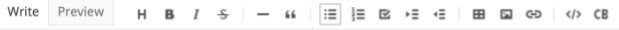

# info-edit
edit markdown captions stored in Google Sheets for infographics

## Goal

One of the hurdles with [infographiq](https://marinebon.github.io/infographiq/) development has been easy editing of captions and other text based content. Presently content contributors need to enter formatted text as [markdown](https://www.markdownguide.org) into the cell of a Google Sheet. We promote the eventual adoption of a content management system like WordPress to handle this aspect. Meanwhile we can rapidly prototype this functionality using the Shiny application development framework in R. This will enable editing of captions as markdown currently stored in Google Sheets from a simple app that provides a toolbar (Figure 2) for users to format text, such as species names in italics, bold for emphasis, bullets for lists and links. The Shiny app will read and update the appropriate Google Sheet cell using the [googlesheets4](https://googlesheets4.tidyverse.org) R package.

_Example what you see is what you get (WYSIWIG) toolbar available from the [shinymarkdown](https://github.com/jdtrat/shinymarkdown#demos) R package from a Shiny app._

## Example: Olympic Coast National Marine Sanctuary

* Google Sheet: [Master\_OCNMS\_infographic\_content](https://docs.google.com/spreadsheets/d/1C5YAp77WcnblHoIRwA_rloAagkLn0gDcJCda8E8Efu4/edit#gid=1920488482)
